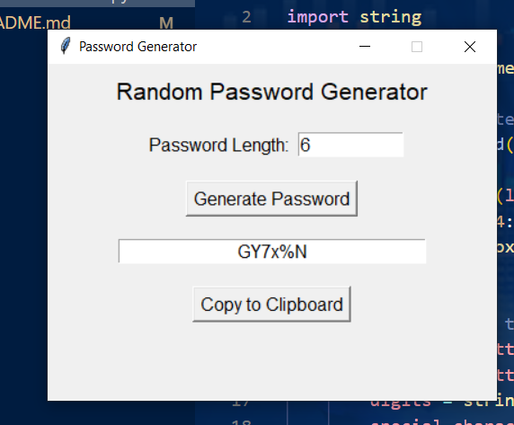

# Python Project Submission: Random Password Generator (RPG)

---

## 📝 Submitted To:
**Instructor**: Dr. Prateek Raj Gautam  

---

## 🙋‍♂️ Submitted By:
**Name**: Anurag Kumar Singh  
**SAP ID**: 590018370  

---

## 📌 Project Title:
**Random Password Generator (RPG)**

---

## 🔍 Description:
The **Random Password Generator Project** is a Python-based application designed to help users create strong, secure passwords effortlessly. This project leverages the power of the **Tkinter** library to provide a simple, user-friendly graphical interface for generating passwords that combine letters, numbers, and special characters.

This tool is ideal for improving online security by generating unique and complex passwords.

---

## ✨ Features:
1. **Random Password Generation**: Creates strong passwords with a mix of uppercase letters, lowercase letters, numbers, and special characters.
2. **Customizable Length**: Users can specify the desired password length (minimum 4 characters).
3. **User-Friendly Interface**: Built with Tkinter for an intuitive and interactive experience.
4. **Clipboard Support**: Allows easy copying of generated passwords to the clipboard for seamless usage.
5. **Secure by Design**: Ensures passwords are randomized and secure for online and offline use.

---


## ⚙️ Installation:

### Clone the Repository:
```bash
git clone "https://github.com/anurag815311/RPG--project.git"
```


---

## 🚀 Usage:

1. Run the application:
   ```bash
   python Passwordrandom.py
   ```
2. Enter the desired password length in the provided field.
3. Click the **Generate Password** button to create a random password.
4. Copy the generated password using the **Copy to Clipboard** button for easy use.

---

## 📚 Libraries Used:
- **Tkinter**: For creating the graphical user interface.
- **Random**: For generating random characters for the password.
- **String**: For accessing character sets like letters, digits, and punctuation.

---

## 🖼️ Screenshots:
### Example Interface:


